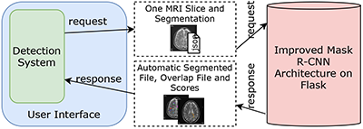
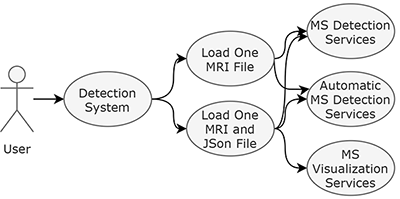

---
# DeepMSWeb

A Web-Based Decision Support System via Deep Learning for Automatic Detection of MS Lesions

## Introduction

This reposity a Flask application for detection of MS lession with Mask R-CNN 

And this application three services

## Background
The application include improved [matterport-maskrcnn](https://github.com/matterport/Mask_RCNN)

## How To Use

`make project`

`cd project`

`python -m venv .env`

`.env\Script\activate`

next 2 lines for cuda 10.1

`pip install tensorflow==2.2.0`

`pip install keras==2.3.1  `    

after at all:

`pip install -r requirements.txt`

Citing Improved Mask R-CNN
***

Citing DeepMSWeb
***

