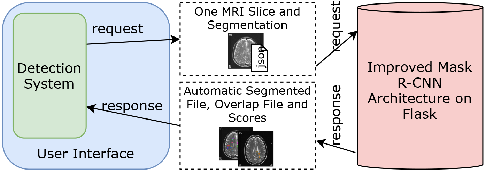
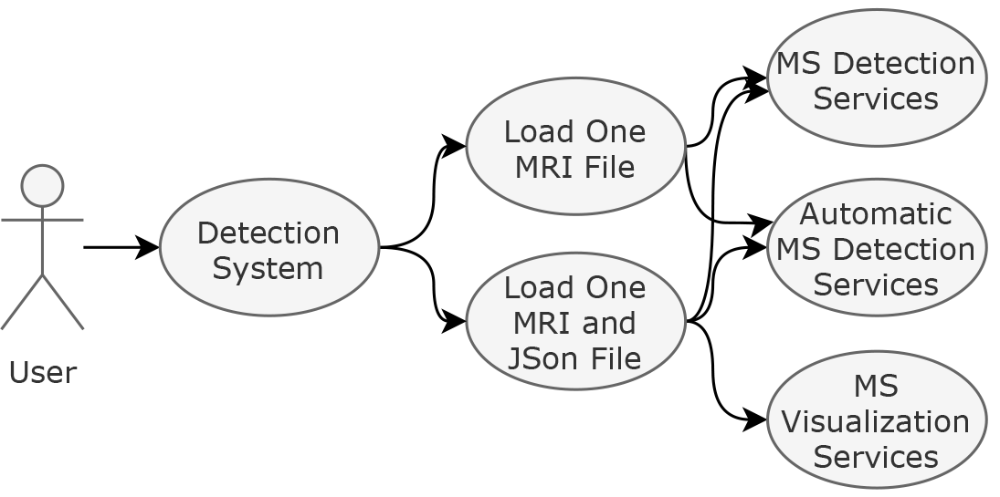

---
---

# DeepMSWeb

A Web-Based Decision Support System via Deep Learning for Automatic Detection of MS Lesions

## Introduction

This reposity a Flask application for detection of MS lession with Mask R-CNN 

And this application three services

## Background
The application include improved [matterport-maskrcnn](https://github.com/matterport/Mask_RCNN)

## How To Use

